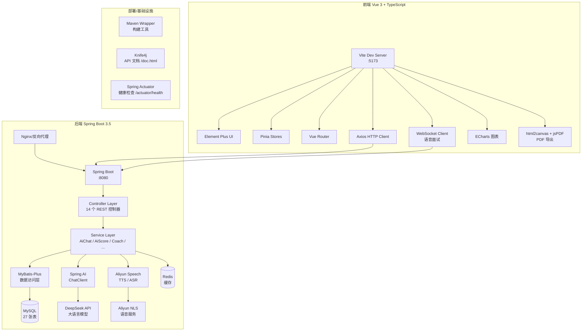

<p align="center">
  <h1 align="center">面试吧 (Mianshiba)</h1>
  <p align="center">AI 驱动的求职面试模拟平台</p>
</p>

<p align="center">
  
  
  
  
  
  
  
  
</p>

## 项目简介

面试吧是一个基于 AI 大语言模型的求职面试模拟与简历优化平台。它帮助求职者通过 AI 模拟面试、简历优化、岗位匹配和求职教练等功能，系统化地提升面试能力和求职效率。

### 核心功能

| 功能模块 | 说明 |
|---------|------|
| **AI 模拟面试** | 基于 DeepSeek 大模型模拟真实面试，支持语音/文字作答，面试后生成详细评分报告 |
| **简历管理** | 在线编辑简历，支持 3 种模板切换，AI 优化单模块/整份简历，AI 评分诊断 |
| **求职教练** | 综合分析简历、面试、投递和训练数据，生成求职诊断报告和 7 天提升计划 |
| **岗位投递** | 全流程投递管理（待投递→面试中→Offer），面试轮次追踪 |
| **AI 刷题** | 智能生成八股训练题，AI 评审答案，薄弱知识点追踪 |
| **数据看板** | 全维度数据统计与可视化图表，监控求职进展 |

## 系统架构



## 技术栈

### 后端

| 技术 | 版本 | 用途 |
|------|------|------|
| Java | 17 | 运行语言 |
| Spring Boot | 3.5.x | 应用框架 |
| Spring AI | 1.1.2 | AI 大模型集成（DeepSeek） |
| MyBatis-Plus | 3.5.7 | ORM 数据访问 |
| MySQL | 8.0+ | 关系数据库（27 张表） |
| Redis | 7+ | 缓存 |
| JJWT | 0.12.6 | JWT 鉴权 |
| Knife4j | 4.5.0 | API 文档 |
| Aliyun NLS | 2.2.19 | 语音合成/识别 |
| Lombok | — | 减少样板代码 |

### 前端

| 技术 | 版本 | 用途 |
|------|------|------|
| Vue | 3.5.x | 前端框架 |
| TypeScript | 5.8 | 类型安全 |
| Vite | 7.x | 构建工具 |
| Pinia | — | 状态管理 |
| Vue Router | — | 路由 |
| Element Plus | — | UI 组件库 |
| Axios | 1.16 | HTTP 客户端 |
| ECharts | — | 数据可视化 |
| html2canvas + jsPDF | — | PDF 导出 |

## 快速开始

### 前置要求

- JDK 17+
- Node.js ^20.19.0 或 >=22.12.0
- MySQL 8.0+
- Redis 7+
- DeepSeek API Key

### 环境变量

| 变量 | 必需 | 默认值 | 说明 |
|------|------|--------|------|
| `MYSQL_HOST` | 否 | 127.0.0.1 | MySQL 地址 |
| `MYSQL_PORT` | 否 | 3306 | MySQL 端口 |
| `MYSQL_DATABASE` | 否 | mianshiba | 数据库名 |
| `MYSQL_USERNAME` | **是** | — | MySQL 用户名 |
| `MYSQL_PASSWORD` | **是** | — | MySQL 密码 |
| `REDIS_HOST` | 否 | 127.0.0.1 | Redis 地址 |
| `REDIS_PORT` | 否 | 6379 | Redis 端口 |
| `REDIS_PASSWORD` | 否 | — | Redis 密码 |
| `AI_DEEPSEEK_API_KEY` | **是** | — | DeepSeek API Key |
| `JWT_SECRET` | **是** | — | JWT 密钥（至少 32 字节） |

### 启动后端

```powershell
cd backend
.\mvnw.cmd spring-boot:run
# 使用 local profile（含硬编码密码，仅开发用）
.\mvnw.cmd spring-boot:run -Dspring.profiles.active=local
```

后端启动后访问：
- API 文档：http://localhost:8080/doc.html
- 健康检查：http://localhost:8080/actuator/health

### 启动前端

```powershell
cd frontend
npm install
npm run dev
```

前端启动后访问：http://localhost:5173

### 构建

```powershell
# 后端构建
cd backend
.\mvnw.cmd clean package -DskipTests

# 前端构建
cd frontend
npm run build
```

## 项目结构

```
mianshiba/
├── backend/                        # Spring Boot 后端
│   ├── src/main/java/com/mianshiba/ai/
│   │   ├── common/                 # 通用响应、错误码、异常
│   │   ├── config/                 # 配置类（AI、JWT、安全）
│   │   ├── controller/             # REST 控制器（14 个模块）
│   │   ├── mapper/                 # MyBatis-Plus Mapper
│   │   ├── model/
│   │   │   ├── dto/                # 请求 DTO
│   │   │   ├── entity/             # 数据实体
│   │   │   ├── enums/              # 枚举
│   │   │   └── vo/                 # 响应 VO
│   │   ├── scheduler/              # 定时任务
│   │   ├── service/                # 业务逻辑（接口 + impl）
│   │   └── utils/                  # 工具类（JWT 等）
│   ├── src/main/resources/
│   │   ├── sql/init.sql            # 数据库建表脚本
│   │   └── application.yml         # 主配置
│   └── pom.xml
│
├── frontend/                       # Vue 3 前端
│   ├── src/
│   │   ├── api/                    # API 请求（按模块分）
│   │   ├── assets/styles/          # 全局样式 + CSS 变量
│   │   ├── components/             # 通用组件
│   │   │   ├── charts/             # ECharts 图表组件
│   │   │   └── resume/             # 简历相关组件
│   │   ├── composables/            # 组合式函数
│   │   ├── layouts/                # 布局组件
│   │   ├── router/                 # 路由配置（30+ 路由）
│   │   ├── stores/                 # Pinia 状态管理
│   │   ├── templates/              # 简历模板（3 种）
│   │   ├── types/                  # TypeScript 类型
│   │   ├── utils/                  # 工具函数
│   │   └── views/                  # 页面视图
│   └── package.json
│
├── docs/                           # 项目文档
└── AGENTS.md                       # AI 开发助手配置
```

## 数据库

共 27 张表，`backend/src/main/resources/sql/init.sql` 自动建表：

| 模块 | 表 |
|------|----|
| 用户 | `user` |
| 简历 | `resume`, `resume_section`, `resume_chat_message`, `resume_version` |
| 面试 | `interview_session`, `interview_turn`, `interview_report`, `interview_report_enhancement`, `interview_turn_review` |
| 职位 | `job`, `job_analysis`, `job_match`, `job_favorite` |
| 公司 | `company`, `company_certification` |
| 投递 | `job_application`, `application_todo`, `application_round` |
| 训练 | `training_plan`, `training_question`, `training_answer`, `training_answer_review`, `algorithm_recommendation`, `training_mastery` |
| 教练 | `coach_diagnosis`, `coach_plan`, `coach_task` |

## 前端路由

| 路径 | 页面 |
|------|------|
| `/` | 首页 |
| `/login` | 登录/注册 |
| `/profile` | 个人资料 |
| `/resume` | 简历列表 |
| `/resume/new` | 新建简历（空白/AI 生成） |
| `/resume/:id/edit` | 编辑简历（含 AI 优化） |
| `/resume/:id/preview` | 简历预览（支持 PDF 导出） |
| `/interview` | 面试列表 |
| `/interview/new` | 新建面试 |
| `/interview/:id/room` | 面试房间（语音+文字） |
| `/interview/:id/report` | 面试报告 |
| `/applications` | 投递列表 |
| `/applications/new` | 新建投递 |
| `/applications/:id` | 投递详情（面试轮次） |
| `/training` | 训练中心 |
| `/training/plan/:id` | 训练计划 |
| `/training/question/:id` | 做题 |
| `/coach` | 求职教练 |
| `/coach/diagnosis/:id` | 诊断详情 |
| `/coach/plan/:id` | 周计划详情 |
| `/analytics` | 数据看板 |
| `/admin` | 管理后台 |

## API 端点

| 模块 | 前缀 | 说明 |
|------|------|------|
| 用户 | `POST /api/user/register`, `POST /api/user/login` | 注册登录 |
| 简历 | `GET/POST/PUT /api/resume/**` | CRUD + AI 优化/评分/对话 |
| 面试 | `POST /api/interview/**` | 面试全流程 + WebSocket 语音 |
| 投递 | `GET/POST/PUT /api/application/**` | 投递管理 + 面试轮次 |
| 训练 | `GET/POST /api/training/**` | 训练计划/答题/评审 |
| 教练 | `POST /api/coach/diagnose` | AI 求职诊断和计划 |
| 管理 | `GET /api/admin/**` | 用户管理 |
| 统计 | `GET /api/statistics/**` | 数据统计 |

## 评分体系

### 面试评分维度

| 维度 | 说明 |
|------|------|
| `accuracy` | 技术准确性 |
| `clarity` | 表达清晰度 |
| `depth` | 项目深度 |
| `matching` | 岗位匹配度 |

### 简历评分维度

| 维度 | 说明 |
|------|------|
| `completeness` | 完整性 |
| `professionalism` | 专业性 |
| `matching` | 岗位匹配度 |

## 许可证

MIT
